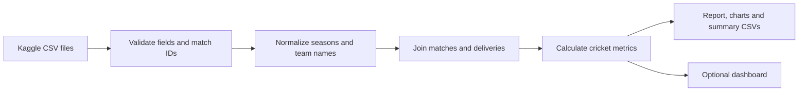

<div align="center">

# 🏏 BOUNDARY
### IPL Data Analysis · 2008–2024

**Exploring player performance and league trends through Python.**


[Overview](#overview) · [Findings](#findings) · [Run the analysis](#run-the-analysis) · [Methodology](#methodology) · [Sources](#sources)

</div>


## Overview

Boundary is a Python data analytics portfolio project exploring the Indian Premier League through match-level and ball-by-ball data. It combines validation, cleaning, relational joins, aggregation and visualization to investigate batting performance, bowling effectiveness and seasonal scoring patterns.

Run the analysis as a regular Python script to produce a written report, summary CSVs and a chart. An optional Streamlit dashboard supports interactive exploration. **No hosting or deployment is required.**

| Matches | Raw delivery records | Seasons | Coverage |
| :---: | :---: | :---: | :---: |
| **1,095** | **260,920** | **17** | **2008–2024** |

## Questions explored

- Which batters accumulated the most runs, and how does scoring volume relate to strike rate?
- Which bowlers took the most credited wickets, and how does economy change the comparison?
- How did scoring pace change across IPL seasons?
- Which teams won the most finals in the recorded period?
- How do player and team comparisons change with season filters?

## Findings

The bundled snapshot, excluding super overs from player statistics, shows:

| Finding | Result |
| --- | --- |
| Leading run scorer | **V Kohli — 8,004 runs** |
| Leading wicket taker | **YS Chahal — 205 credited wickets** |
| Share of batter runs from boundaries | **59.9%** |
| Most championships | **Mumbai Indians and Chennai Super Kings — 5 each** |

These are descriptive results from the dataset, not live records. Player names retain the source's spelling. Read the [generated findings report](reports/findings.md) for seasonal scoring results and interpretation.

## Analysis workflow



| Stage | Work performed |
| --- | --- |
| Validation | Required columns, unique match IDs, numeric values, run reconciliation and matching delivery IDs |
| Preparation | Parse dates, derive season years, combine team renames and join metadata |
| Metric design | Distinguish balls faced from legal balls, exclude non-bowler dismissals and calculate weighted rates |
| Exploration | Rank players, summarize finals and examine seasonal trends |
| Communication | Reproducible charts, aggregate tables and a findings report |
| Verification | Test a known match performance, extras, dismissals, filters and invalid joins |

## Run the analysis

Use **Python 3.12**. Download or clone this repository and open a terminal inside its folder.

```bash
python -m venv .venv
```

Activate the environment:

```powershell
# Windows PowerShell
.venv\Scripts\Activate.ps1
```

```bash
# macOS / Linux
source .venv/bin/activate
```

Install dependencies and generate the analysis:

```bash
python -m pip install -r requirements.txt
python analyze.py
```

The script writes its outputs to `reports/`. The original Kaggle CSVs are included. No dataset search or hardcoded computer path is needed.

<details>
<summary><strong>Optional: explore the interactive dashboard</strong></summary>

```bash
python -m streamlit run app.py
```

On Windows, `run.bat` also sets up and launches the dashboard. Its nine pages cover Overview, Season Winner, Top Batsmen, Top Bowlers, Player Comparison, Batting Lab, Bowling Lab, Teams & Champions, and Data Explorer. Navigation uses styled buttons with an active-page highlight. Choose a season, then open Season Winner to display its champion, season-specific team photo and final result. Winner photos appear only on that page, never in the sidebar or other pages. The same selection filters every chart and table. Player comparisons, chart hover and CSV exports support further investigation.

The browser interface runs locally. Close the server with Ctrl+C when finished. See [SETUP.md](SETUP.md) for detailed instructions.

</details>

## Repository structure

```text
ipl-analytics/
├── README.md                 # Portfolio overview
├── SETUP.md                  # Detailed dashboard setup
├── analyze.py                # Standalone analysis; no server needed
├── analytics.py              # Validation, cleaning and metrics
├── app.py                    # Optional interactive exploration
├── champion_photos.py        # Season-specific online winner photos
├── download_data.py          # Re-download Kaggle CSVs
├── test_analytics.py          # Calculation and data tests
├── requirements.txt          # Dependency versions
├── run.bat                   # Optional Windows dashboard launcher
├── .gitignore                # Excludes environments, caches and secrets
├── .github/workflows/tests.yml
├── .streamlit/config.toml
├── data/
│   ├── matches.csv
│   ├── deliveries.csv
│   └── provenance.json       # Source and SHA-256 hashes
└── reports/
    ├── findings.md
    ├── analysis-overview.png
    ├── batting.csv
    ├── bowling.csv
    ├── titles.csv
    └── season_trends.csv
```

## Methodology

| Metric / choice | Definition |
| --- | --- |
| Season | Calendar year of match date, handling source labels such as `2007/08` |
| Batter runs | Sum of runs credited to the batter |
| Balls faced | Records excluding wides; no-balls are included |
| Strike rate | Batter runs ÷ balls faced × 100 |
| Legal balls | Deliveries excluding wides and no-balls |
| Bowler wickets | Caught, bowled, lbw, caught and bowled, stumped, hit wicket |
| Economy | Runs charged ÷ legal balls × 6 |
| Runs charged | Batter runs plus wide/no-ball extras; excludes byes, leg-byes and penalties |
| Boundary share | Runs from fours and sixes ÷ total batter runs |
| Championships | Winners of match rows marked `Final` |

Super overs are excluded from delivery statistics. Zero-denominator rates are left unavailable. Team renames are combined, while distinct franchises remain separate. The original CSVs are preserved; transformations happen in Python.

## Limitations

- The snapshot ends in **2024**. It contains no live scores or later seasons.
- Career totals reflect playing opportunities. Compare rates alongside sample sizes.
- Venue labels and player name variations are retained from the source.
- Shot coordinates are unavailable, so this project uses actual scoring distributions instead of a simulated wagon wheel.
- Seasonal trends are observational and do not establish causation.
- The dashboard uses one selected season at a time. The standalone analysis covers every season.

## Tests and reproducibility

```bash
python -m unittest -v test_analytics.py
```

Five tests cover the snapshot, season mapping, McCullum's opening-match 158 off 73, extras, wicket attribution, filters, super-over exclusion and unmatched IDs. GitHub Actions is configured to run the tests and analysis on pushes and pull requests.

The snapshot was downloaded on **13 September 2026**. Its source and hashes are in [data/provenance.json](data/provenance.json). Refresh with `python download_data.py`. If the source changes, regenerate reports and update snapshot-specific tests and README findings.

## Sources

- **Data:** [IPL Complete Dataset (2008–2024), Patrick / Kaggle](https://www.kaggle.com/datasets/patrickb1912/ipl-complete-dataset-20082020). Consult the source for dataset licensing.
- **Champion photographs:** [News24 — IPL winners gallery](https://news24online.com/photos/sports/from-rr-to-rcb-ipl-winners-since-2008-revealed-mi-and-csk-won-it-five-times-three-time-champions-were-kkr-849640). The gallery labels a separate team photograph for each season. Original photo rights remain with their respective owners; the repository references remote URLs and does not redistribute the photo files. These images are not included in any code license.
- **README visualization:** generated from the bundled data by `analyze.py`.

The optional dashboard loads its champion photographs from the web; viewing those photographs requires internet. Source credits live here rather than in the dashboard. Analysis and locally saved charts work offline after installing dependencies.

---

<div align="center">
<strong>Python · Data cleaning · Exploratory analysis · Visualization · Reproducibility</strong>
</div>


### Season selector verification

All 17 seasons were checked against the final winners in `matches.csv`, with distinct image URLs for every year. All image endpoints returned HTTP 200 with an image content type during verification. All nine pages passed navigation checks; leaving Season Winner removes its photo. Batting and bowling comparisons were checked against the underlying aggregates for 2008, 2022 and 2024.


### Player comparison and leaderboards

Player Comparison supports two distinct batters or two distinct bowlers from the same selected season. It shows matching totals, ball counts, rates, side-by-side charts and an exportable CSV. Direct comparisons have no qualification threshold; sample sizes remain visible. Top Batsmen ranks by runs and Top Bowlers ranks by credited wickets. The Batting Lab scatter uses a fixed 100-ball minimum and the Bowling Lab economy table uses a fixed 120-legal-ball minimum, labelled next to their charts/tables. Both sliders have been removed.
