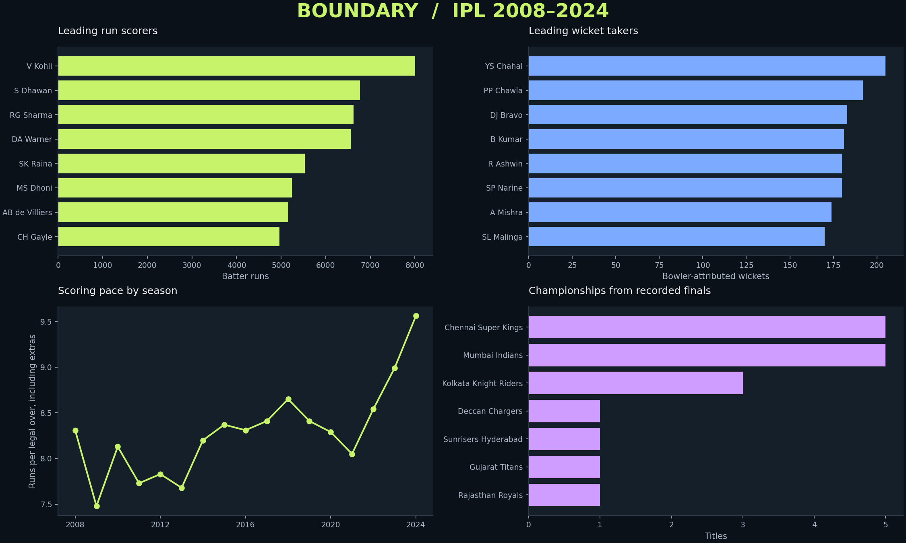

# IPL analysis findings

Generated from the bundled Kaggle snapshot by `python analyze.py`.

## Scope

1,095 matches across 17 seasons (2008–2024).
260,920 raw delivery records; 260,759 records after excluding super overs.

## Findings

- **V Kohli** leads the run table with **8,004 runs**.
- **YS Chahal** leads with **205 bowler-attributed wickets**.
- Scoring pace was **8.31** runs per legal over in 2008 and **9.56** in 2024.
- Fours and sixes account for **59.9%** of batter runs.
- **Chennai Super Kings, Mumbai Indians** share the most titles in this snapshot, with **5 each**.

## Interpretation

Career totals reflect opportunity as well as performance. Compare strike rate and economy alongside balls faced or bowled, and apply minimum-ball thresholds when comparing players.
Seasonal scoring differences are descriptive. This analysis does not establish causes such as venue conditions or rule changes.

## Reproduce

Run `python analyze.py` from the repository after installing requirements. The four adjacent CSVs contain the underlying aggregate tables. See the README for definitions, exclusions and source attribution.
